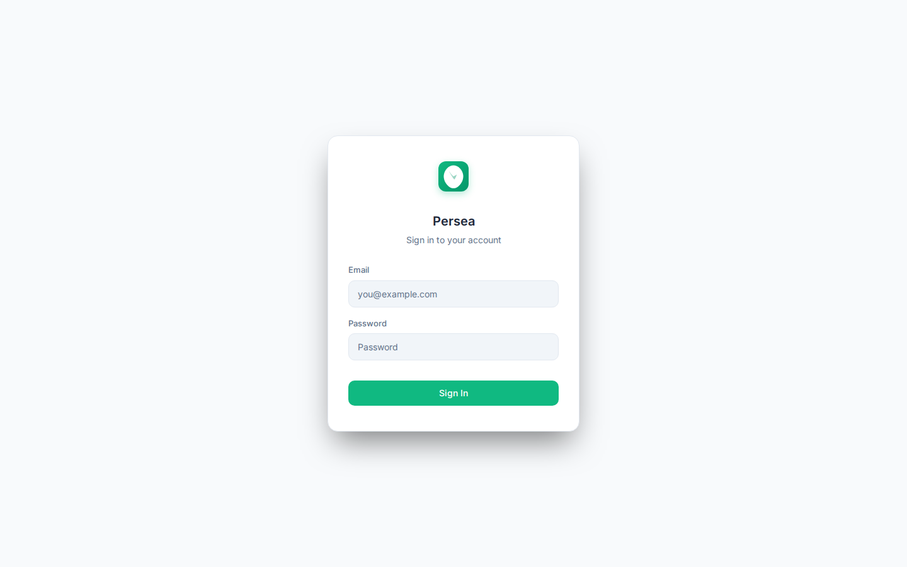
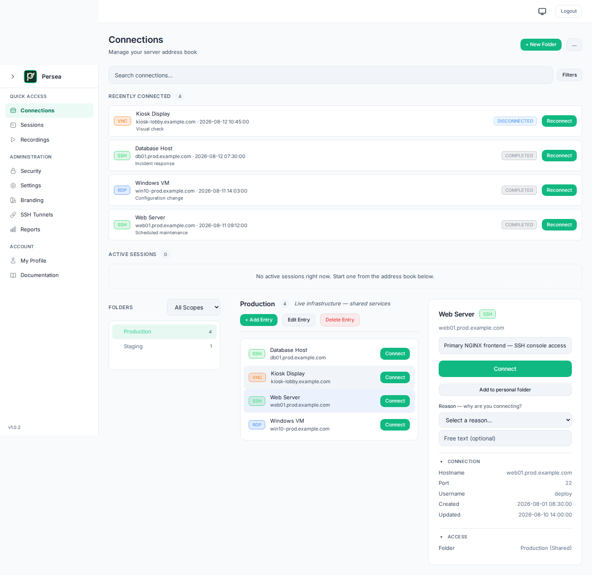
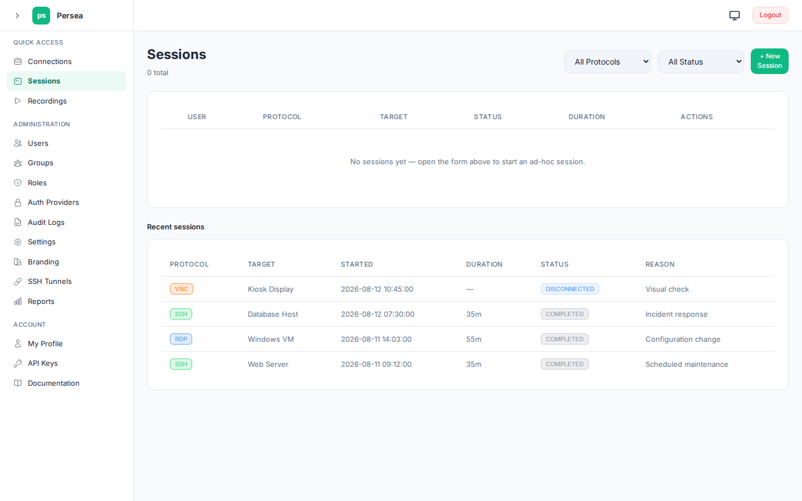

# Persea

[](https://github.com/persea-grove/persea/actions/workflows/ci.yml)
[](https://github.com/persea-grove/persea/releases/latest)
[](https://github.com/persea-grove/persea/releases)
[](https://www.apache.org/licenses/LICENSE-2.0)

A modern frontend for Apache Guacamole. Browser-based SSH, RDP, VNC, SPICE, Proxmox VE consoles, web browsing, and VDI desktop containers through [guacd](https://github.com/apache/guacamole-server).

Single binary plus guacd. No Java, no Tomcat.

## Screenshots

| | | |
|---|---|---|
|  |  |  |

## Why "Persea"?

Someone will ask why the name Persea. Fair question. Guacamole is a fine name for open source software, but pitching it to enterprise leadership runs into the problem that it sounds like a dip. I wanted something that felt more professional for client-facing use.

I cycled through food names that pay homage to the original. Tortilla Chip. Salsa. Corn Chip. They all sound like side projects. Then Persea came up, text popping up on a screen, courtesy of the same AI that helped me build this thing. It is the genus of avocados. Sounds polished, works in a business context, and still connects to the Guacamole roots. [Learn more about the Persea genus](https://en.wikipedia.org/wiki/Persea).

## Why this exists

Guacamole is great software. Apache maintains it well, and the protocol handling under the hood is solid. The frontend looks like it was designed in 2005, which kept me from recommending it at work or for clients. I ran it in my homelab and that was about it.

[Sol1](https://github.com/sol1/rustguac) put out RustGuac and it scratched the itch. A Rust frontend for Guacamole, open source, community-driven. It lacked broader SSO support beyond OIDC, had rough edges in the UI, and gaps in the docs.

I do not write code. Ten years in IT taught me how the pieces connect. AI coding tools changed what I could build with that knowledge. I forked Sol1's repo, pointed OpenCode at it, and got to work.

This is a side project alongside a day job. Progress comes in bursts.

If you get use out of this, star Sol1's repo too. They built the base layer.

Found something broken? Open an issue with logs and screenshots.

## Licensing

persea is a hobby project: Apache-2.0, free. No license keys, no feature gates, no evaluation period. Everything in the feature lists below is available to everyone.

## Architecture

```
Browser (HTML/JS)
    |
    | WebSocket over HTTPS
    v
persea (Rust, axum)
    |
    | TCP (Guacamole protocol)
    v
guacd (C, from guacamole-server)
    |
    +---> SSH server
    +---> RDP server
    +---> VNC server
    +---> SPICE server (libvirt/QEMU displays)
    +---> Proxmox VE VM console (SPICE via the PVE spiceproxy API)
    +---> Xvnc + Chromium (web browser sessions)
    +---> Docker container + xrdp (VDI desktop sessions)
```

## Features

### Session types

| Type | Description |
|------|-------------|
| **SSH** | Browser terminal with password, private key, or ephemeral keypair auth. SFTP file transfer. |
| **RDP** | Windows/Linux RDP with auto-fit resize, Kerberos NLA, RemoteApp/RAIL, H.264 passthrough, GFX pipeline. |
| **VNC** | Connect to any VNC server (KVM/IPMI consoles, remote desktops, VM displays). |
| **SPICE** | Direct SPICE displays (libvirt/QEMU consoles) with TLS, CA verification, certificate-subject pinning, SPICE-proxy support. |
| **Proxmox VE** | VM consoles through the Proxmox API. One-time SPICE tickets fetched at connect, node auto-detected from VM ID, SSH-tunnel aware. |
| **VMware vSphere** | VM inventory and console brokering through the vCenter REST API, with OS-aware RDP/SSH/VNC routing. |
| **Web** | Headless Chromium on Xvnc with native autofill, domain allowlisting, login script automation. |
| **VDI** | Ephemeral Docker desktop containers per user. Persist after disconnect, auto-cleanup on idle. |

### Security and authentication

- **OIDC single sign-on**: Authentik, Google, Okta, Keycloak, or any OpenID Connect provider
- **LDAP / Active Directory**: bind + search authentication
- **SAML 2.0**: service provider with signature verification
- **RADIUS**: PAP authentication for network equipment integration
- **Database auth**: local password accounts with Argon2id hashing
- **TOTP two-factor**: enrollment, QR codes, recovery codes
- **TOTP / MFA enforcement**: mandatory two-factor policies
- **4-tier role system**: admin, poweruser, operator, viewer with OIDC group mapping
- **Fine-grained RBAC**: connection-level permissions and group inheritance
- **API key auth**: SHA-256 hashed keys with IP allowlists and expiry
- **Vault-backed connections**: credentials in HashiCorp Vault or OpenBao KV v2, never reach the browser (see [Requirements](#requirements))
- **TLS everywhere**: HTTPS for clients, TLS between persea and guacd
- **CIDR allowlists**: per-protocol network restrictions for session targets
- **Per-entry clipboard control**: disable copy and/or paste for data loss prevention
- **Rate limiting**: per-IP, per-endpoint via tower_governor
- **Session recording**: Guacamole format with playback UI, disk rotation, per-entry limits
- **Encrypted session recording**: recordings encrypted at rest
- **Audit logging**: SHA-256 hash chain with tamper evidence
- **Audit log retention and compliance exports**
- **High availability / clustering**: multi-instance deployments behind a load balancer

### Connectivity

- **Multi-hop SSH tunnels**: chain jump hosts/bastions to reach isolated networks (all session types, including the Proxmox API and console hops)
- **Session sharing**: share tokens for read-only or collaborative access
- **Headless API integration**: create a session over the REST API and hand a browser a ready-to-open URL via a single-use WebSocket ticket, with no OIDC login and no API key in the browser (see [Connecting to a session](docs/api.md#connecting-to-a-session))
- **Encrypted file transfer**: LUKS-encrypted per-session drive storage (RDP), SFTP (SSH)
- **Credential variables**: shared credentials across connections entries

### VDI desktop containers

- **Docker-based**: one container per user, deterministic naming, BYO image
- **Persist after disconnect**: reconnect to the same desktop within idle timeout
- **Logout detection**: desktop logout stops the container, tab close preserves it
- **Session thumbnails**: live preview in the connections, click to reconnect
- **Persistent home directories**: bind-mounted user data survives container restarts
- **Per-entry resource limits**: CPU, memory, idle timeout per connections entry
- **VdiDriver trait**: extensible for downstream forks (Nomad, Proxmox, cloud)

### UI

- **Sidebar navigation** across all pages
- **Connections** with folder-based organisation and OIDC group access control
- **Active Sessions** section with live thumbnail previews
- **Session ended overlay** with Reconnect/Close buttons
- **Clipboard panel controls** (Home + Fullscreen)
- **8 built-in themes** with CSS gradient backgrounds, or configure your own
- **Reports page** with session analytics, history, and CSV export
- **Dark mode** by default with light mode toggle
- **Responsive layout** from laptop to ultrawide displays

## Requirements

| Component | Status | Notes |
|-----------|--------|-------|
| guacd | Required | Built from `apache/guacamole-server`, ships in the .deb and Docker image. |
| Vault or OpenBao | Optional | For the Connections UI. Stores connection credentials server-side when `[storage] backend = "vault"`. By default connections and credentials live in the app database; Vault is not required. Use [`contrib/vault-quickstart.sh`](contrib/vault-quickstart.sh) for one-command setup. |
| PostgreSQL or MySQL | Optional | Alternative to the built-in SQLite store: set `db_url` in the config (or in the setup wizard at first run) and ALL app data (users, connections, sessions history, audit, settings) lives in that backend. Migrations run automatically at startup. SQLite (`db_path`) remains the default. |
| OIDC provider | Optional | For SSO. API-key auth works on its own. |
| Docker | Optional | Only needed for VDI desktop containers. |

## Quick start

### Debian 13 (.deb)

Pre-built packages for amd64 and arm64 are available from [Releases](https://github.com/persea-grove/persea/releases):

```bash
sudo apt install ./persea_*.deb
/opt/persea/bin/persea --config /opt/persea/config.toml add-admin --name admin
sudo systemctl enable --now persea
```

### Docker

Images are published to the GitHub Container Registry:

```bash
docker pull ghcr.io/barbelldwarf/persea:latest
docker run -d -p 8089:8089 ghcr.io/barbelldwarf/persea:latest
```

For VDI support, mount the Docker socket:

```bash
docker run -d -p 8089:8089 \
  -v /var/run/docker.sock:/var/run/docker.sock \
  --group-add $(getent group docker | cut -d: -f3) \
  ghcr.io/barbelldwarf/persea:latest
```

### Other distributions

Pre-built packages target Debian 13. For other distributions, build from source:

```bash
sudo ./install.sh
```

See the [Installation guide](docs/installation.md) for Docker Compose, TLS setup, and development builds.

### VDI setup

VDI requires Docker on the host:

```bash
curl -fsSL https://get.docker.com | sh
sudo usermod -aG docker persea
sudo systemctl restart persea
```

Add `[vdi]` to your config and create a VDI entry in the connections. See [VDI Desktop Containers](docs/vdi.md) for image requirements and configuration.

## Documentation

### Getting started
- [Installation](docs/installation.md): Debian packages, Docker, bare-metal, development builds
- [Configuration](docs/configuration.md): TOML config reference with all sections
- [Deployment Guide](docs/deployment-guide.md): step-by-step production setup

### Features
- [Roles & Access Control](docs/roles-and-access-control.md): OIDC, roles, group mappings, API tokens
- [Web Browser Sessions](docs/web-sessions.md): autofill, domain allowlisting, login scripts
- [VDI Desktop Containers](docs/vdi.md): Docker desktops, image requirements, persistent homes
- [RDP Video Performance](docs/rdp-video-performance.md): H.264 passthrough, GFX pipeline, xrdp tuning
- [Credential Variables](docs/credential-variables.md): shared credentials across entries
- [Reports](docs/reports.md): session analytics, history, CSV export

### Integration and reference
- [Integrations](docs/integrations.md): Vault, LUKS drives, SSH tunnels, Kerberos, HAProxy, Knocknoc
- [NetBox](docs/netbox.md): connections sync via custom fields and webhooks
- [Security](docs/security-hardening.md): TLS, rate limiting, headers, audit logging, hardening
- [API Reference](docs/api.md): REST API endpoints, the session connection flow, and headless ws-ticket integration
- [Migration from Apache Guacamole](docs/migration.md): MySQL/MariaDB to Vault

## Acknowledgements

[OpenCode](https://opencode.ai) and the OpenCode Go subscription made this project possible. An AI coding agent that just works, a subscription that is worth every cent, and isn't that many cents either. If you are a dev who needs solid pricing for AI coding agents, this is the way to go. They are not a sponsor by the way, just love the product and the ethos.

## Support

persea is a hobby project, funded by its community. If persea saves you time, consider sponsoring it on [GitHub Sponsors](https://github.com/sponsors/barbelldwarf) or supporting it on [Ko-Fi](https://ko-fi.com/barbelldwarf): contributions pay for CI infrastructure, cross-platform build and signing certificates, test machines, and development time.

## License

persea is free software under the [Apache License 2.0](LICENSE). Use it, modify it, sell it: it is a hobby project, everything is included, nothing is gated.

By contributing to persea, you agree to the [Contributor License Agreement (CLA.md)](CLA.md).
