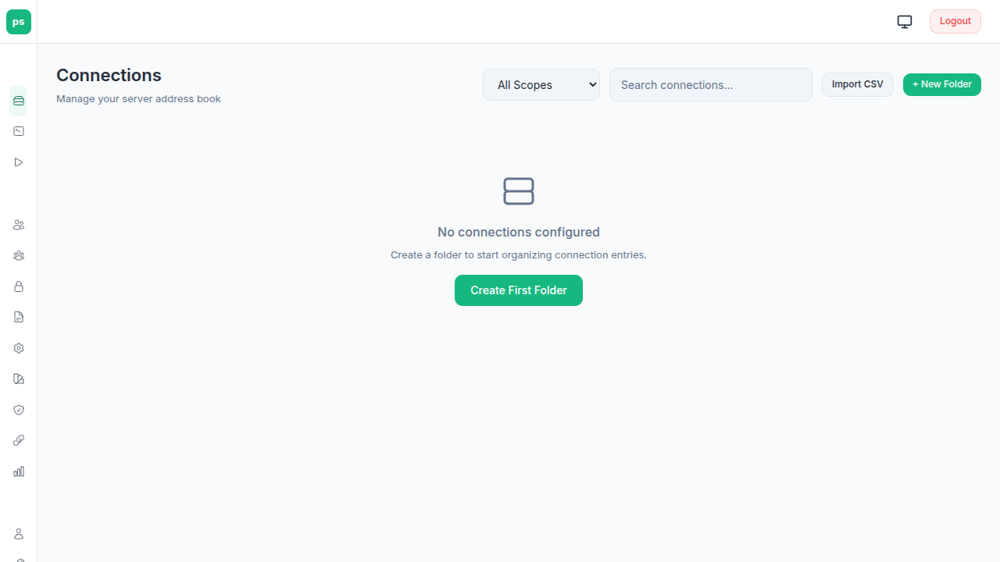
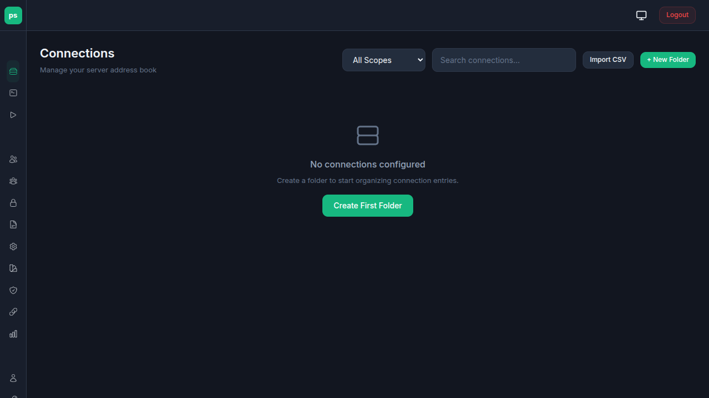
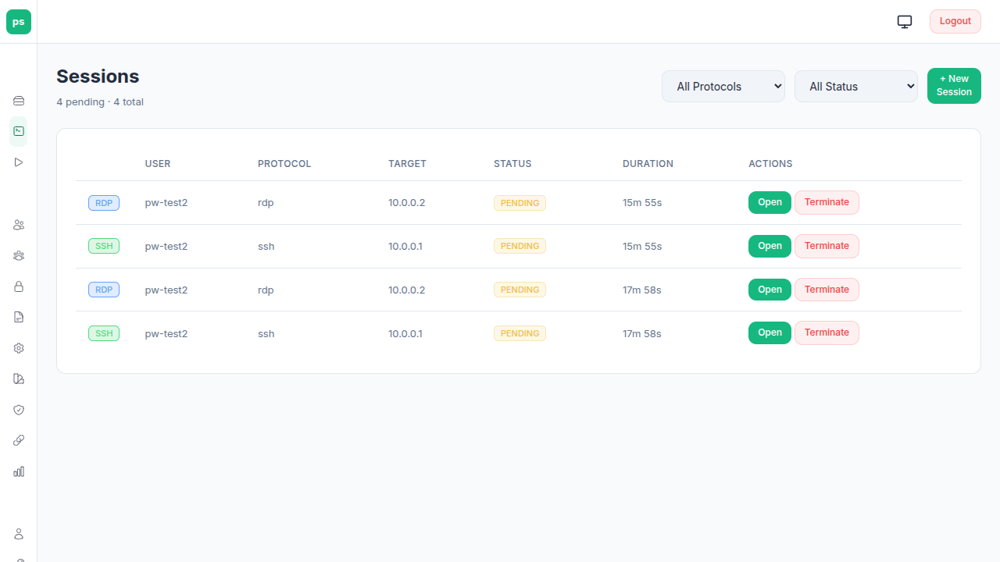
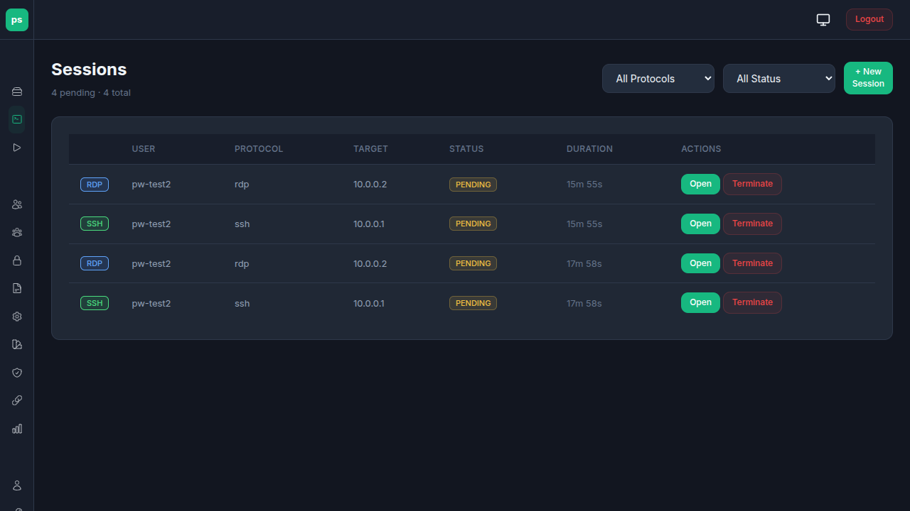
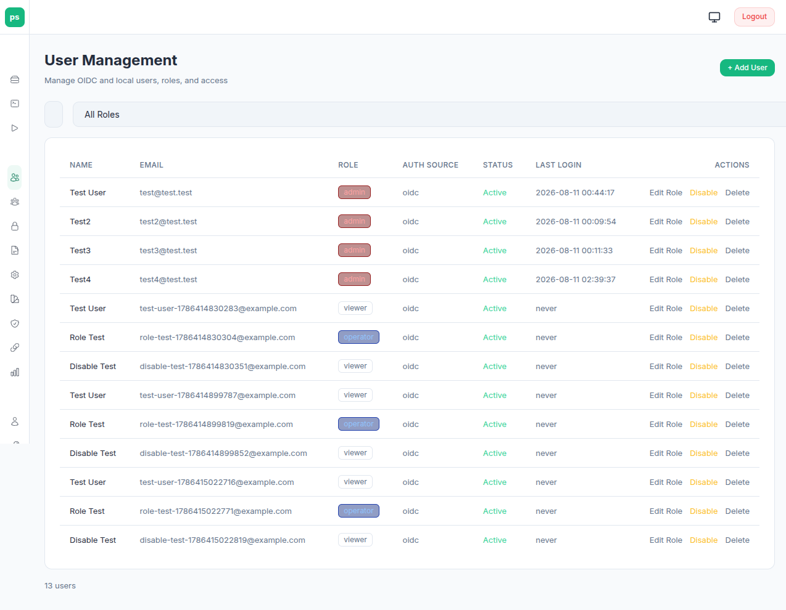
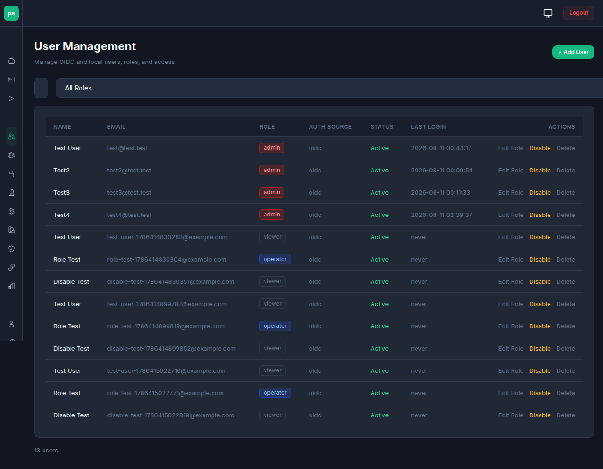
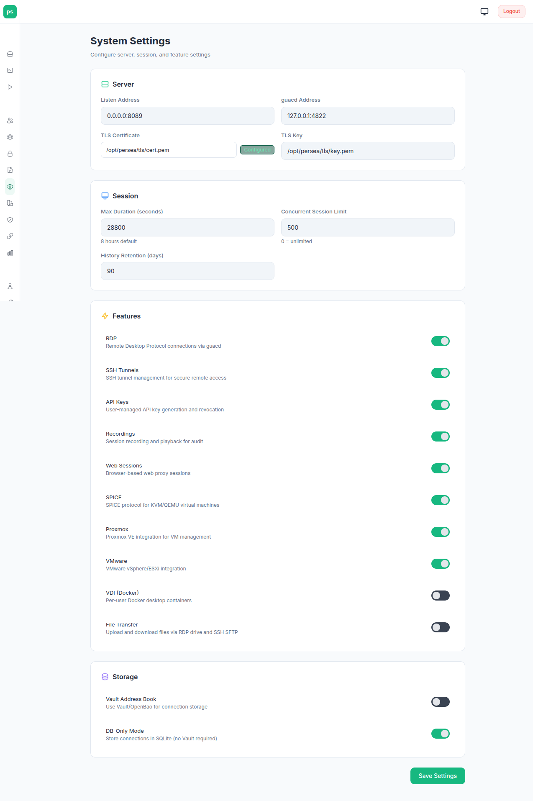
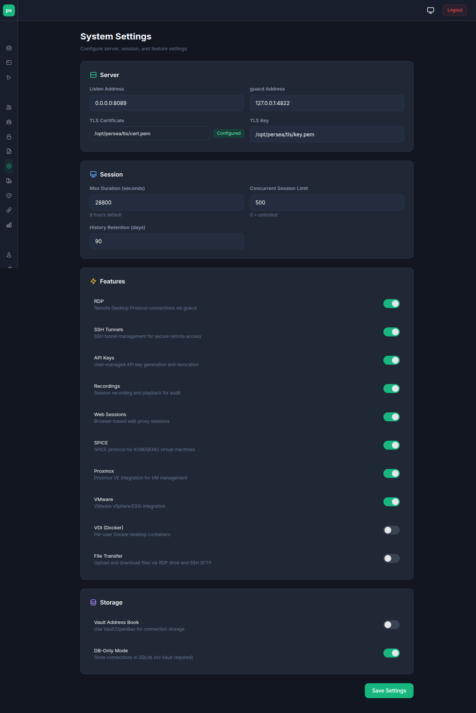

# Overview

## What is persea?

persea is a lightweight Rust replacement for the Apache Guacamole Java webapp. It provides browser-based remote access to SSH, RDP, VNC, SPICE, Proxmox VE, VMware, web browser sessions, and VDI desktop containers through [guacd](https://github.com/apache/guacamole-server), the Guacamole protocol daemon.

persea sits between web browsers and guacd, proxying the Guacamole protocol over WebSockets. It manages session lifecycle, authentication (LDAP, OIDC, SAML, RADIUS, TOTP, database, API keys), session recording, VDI container orchestration, connection-level RBAC, and credential storage (Vault or encrypted DB).

The connections feature supports credential storage in HashiCorp Vault / OpenBao, or directly in the database with AES-256-GCM encryption. See [Configuration](configuration.md) for the full reference.

## Screenshots

persea ships a responsive web UI with built-in light and dark themes — the header toggle cycles **auto → dark → light** (auto follows your OS preference). Screenshots below show key pages in both modes.

### Connections

The Connections page is the main workspace: folder tree on the left, connection details and one-click connect on the right.

| Light | Dark |
|-------|------|
|  |  |

### Sessions

The Sessions page shows active sessions with live status, idle timers, and the ad-hoc session form (SSH/RDP/VNC/SPICE).

| Light | Dark |
|-------|------|
|  |  |

### Admin — Users

The admin area covers user management, groups/RBAC, auth providers, audit logs, settings, and more.

| Light | Dark |
|-------|------|
|  |  |

### Admin — Settings

| Light | Dark |
|-------|------|
|  |  |

The theme toggle is in the header on every page; the chosen mode persists in `localStorage`, and color-accent presets (default, aurora, jaguar, catppuccin-macchiato, and more) are available under **My Profile → Color Accent**.

## Why not Apache Guacamole?

Apache Guacamole is a mature, feature-rich platform. persea is a purpose-built alternative for organisations that want:

- **No Java stack** — persea is a single Rust binary. No Tomcat, no WAR files, no JVM tuning.
- **Auth parity** — LDAP, OIDC, SAML, RADIUS, TOTP MFA, local database, and API keys. Pluggable auth chain with configurable provider ordering and MFA support.
- **Multi-DB support** — MySQL, PostgreSQL, or SQLite. Same binary, same config, different backends.
- **Security-first design** — CIDR allowlists, TLS everywhere, LUKS-encrypted file transfer, Vault integration, rate limiting, SHA-256 hash chain audit logging, Argon2id password hashing, account lockout.
- **Simpler deployment** — one binary + guacd. Install with a single script or Docker image.
- **VDI desktops** — ephemeral Docker containers give each user an isolated Linux desktop on demand. No VM infrastructure required.
- **Connections in Vault or DB** — credentials stored in HashiCorp Vault / OpenBao KV v2, or encrypted at rest in the database with AES-256-GCM. Credentials never reach the browser.
- **VMware vSphere integration** — VM inventory, OS-aware protocol routing (RDP/SSH/VNC), and direct connection to guest IPs via vCenter REST API, with VM list and one-click connect on the Connections page.
- **Connection-level RBAC** — fine-grained permissions on individual connections and connection groups, with group-based inheritance.
- **Zero-trust integration** — works with [Knocknoc](https://knocknoc.io) for identity-aware network access control at the HAProxy layer.

## Similarities to Apache Guacamole

persea and Apache Guacamole share the same foundation:

- **guacd** — both use guacd from [guacamole-server](https://github.com/apache/guacamole-server) for protocol translation. This is the same battle-tested C daemon.
- **Guacamole protocol** — the wire protocol between the webapp and guacd is identical. persea uses the same instruction format, the same JavaScript client library (`guac-common-js`), and the same WebSocket framing.
- **Session recording** — recordings are in the standard Guacamole format and can be played back with the bundled player.
- **SSH/RDP/VNC support** — the same protocol backends provided by guacd. persea adds web browser, VDI container, and Proxmox session types on top.
- **Auth parity** — LDAP, RADIUS, TOTP, SAML, and local database authentication are all supported, matching Apache Guacamole's provider set. persea adds OIDC and a pluggable auth chain with MFA support.

## Key differences from Apache Guacamole

| Feature | Apache Guacamole | persea |
|---------|-----------------|----------|
| **Runtime** | Java (Tomcat + Guice + Jersey) | Rust (single binary) |
| **Database** | MySQL/PostgreSQL | MySQL, PostgreSQL, SQLite |
| **Credential storage** | Database tables | Vault KV v2 (optional) or DB with AES-256-GCM encryption at rest |
| **Authentication** | LDAP, RADIUS, TOTP, SAML, database | LDAP, OIDC, SAML, RADIUS, TOTP MFA, database, API keys — pluggable auth chain |
| **RBAC** | System permissions only | System permissions + connection-level object permissions with group inheritance |
| **Audit logging** | Basic | SHA-256 hash chain with tamper evidence, CLI and admin UI verification |
| **Web sessions** | Not supported | Headless Chromium on Xvnc |
| **Ephemeral SSH keys** | Not supported | Ed25519 keypair per session |
| **File transfer encryption** | Not supported | LUKS + Vault key management |
| **Multi-hop SSH tunnels** | Not supported | Chain multiple SSH bastion hops to reach isolated targets |
| **VMware vSphere** | Not supported | VM inventory, OS-aware protocol routing (RDP/SSH/VNC), one-click connect from the Connections page. |
| **Network allowlists** | Not supported | CIDR allowlists per protocol |
| **Rate limiting** | Not built-in | Per-IP, per-endpoint (tower_governor) |
| **Reverse proxy integration** | Generic | HAProxy + Knocknoc examples |
| **Session sharing** | Connection sharing | Share tokens (read-only or collaborative) |
| **Clipboard control** | Not per-connection | Per-entry disable copy/paste |
| **Web session autofill** | Not supported | Native Chromium autofill from Vault credentials |
| **Web domain allowlist** | Not supported | Per-entry domain restriction via --host-rules |
| **VDI containers** | Not supported | Ephemeral Docker desktop containers per user |

## Architecture

```
Browser (HTML/JS)
    |
    | WebSocket over HTTPS
    v
persea (Rust, axum)
    |
    | TLS (Guacamole protocol)
    v
guacd (C, from guacamole-server)
    |
    +---> SSH server (for SSH sessions)
    +---> RDP server (for RDP sessions)
    +---> VNC server (for VNC sessions)
    +---> Xvnc display (for web browser sessions)
    |         |
    |         +---> Chromium (kiosk mode)
    +---> Docker container :3389 (for VDI sessions)
              |
              +---> xrdp + desktop (xfce4, etc.)
```

For SSH, RDP, VNC, and web browser sessions, an optional multi-hop SSH tunnel chain can route the connection through one or more bastion hosts. VDI sessions connect to local Docker containers and do not use tunnels.

```
Browser -> persea -> SSH tunnel (hop 1) -> SSH tunnel (hop 2) -> ... -> guacd -> target
```

Both links are encrypted by default, with HTTPS between browsers and persea, TLS between persea and guacd.

## Session types

### SSH

Connects guacd directly to a target SSH server. Supports password, private key, and ephemeral keypair authentication. Terminal rendering is handled by guacd's SSH plugin with `xterm-256color` terminal type.

SFTP file transfer is available directly between the browser and the target SSH server, with no files stored on the persea server.

Supports optional [multi-hop SSH tunnel chains](#ssh-tunnel--jump-hosts) to reach targets through bastion hosts.

### RDP

Connects guacd to a target RDP server. Supports username/password, domain, and various RDP settings (security mode, certificate ignore, display resize). Drive redirection provides file transfer via a per-session directory on the persea server.

Supports optional [multi-hop SSH tunnel chains](#ssh-tunnel--jump-hosts) and [Kerberos NLA authentication](integrations.md#rdp-kerberos-nla-authentication).

### VNC

Connects guacd to a target VNC server. Supports password-based authentication. Useful for accessing existing VNC servers on the network (e.g., KVM/IPMI consoles, remote desktops, virtual machine displays).

Supports optional [multi-hop SSH tunnel chains](#ssh-tunnel--jump-hosts) to reach VNC targets through bastion hosts.

### SPICE

Connects guacd to a SPICE server (TLS with CA verification, SPICE proxy support). Ad-hoc SPICE sessions are created from the Sessions page.

### Proxmox VE

Ad-hoc sessions into Proxmox VE guests via the PVE API: SPICE consoles (brokered through the PVE spiceproxy), VNC, LXC containers, and serial consoles (xterm.js). See [API Reference](api.md) for the proxmox session fields.

### Web browser

Spawns a headless Xvnc display and Chromium in kiosk mode, then connects guacd via VNC to the local display. The user sees a full browser session in their own browser. Each session gets an isolated Chromium profile directory.

Web sessions support native autofill, per-entry domain allowlisting, login scripts (CDP-based automation), clipboard control, and Chromium security hardening. See [Web Browser Sessions](web-sessions.md) for the full guide with examples.

Supports optional [multi-hop SSH tunnel chains](#ssh-tunnel--jump-hosts) to reach web targets through bastion hosts.

### VDI (Docker containers)

Spawns an ephemeral Docker container running xrdp and a Linux desktop, then connects guacd via RDP to the container. Each user gets a dedicated container named `persea-vdi-{username}`. Containers persist after disconnect for reconnection and are automatically cleaned up after an idle timeout.

VDI sessions support persistent home directories, per-entry resource limits and idle timeouts, session thumbnails, and active session previews in the connections. See [VDI Desktop Containers](vdi.md) for configuration and image requirements.

## SSH tunnel / jump hosts

SSH, RDP, VNC, and web browser sessions can be routed through one or more SSH bastion hosts using multi-hop SSH tunnel chains. This is useful when target machines are not directly reachable from the persea server. VDI sessions do not support tunnels, as containers run locally.

Each hop in the chain establishes an SSH connection and creates a local TCP port forward (`direct-tcpip`). The hops are chained sequentially, with each hop connecting through the previous hop's local listener. The final hop forwards to the actual target (e.g., an RDP server on port 3389).

```
You -> bastion-1:22 -> bastion-2:22 -> target:3389 RDP
```

Jump hosts can be configured:
- **Per connections entry** — admins configure the tunnel chain in the entry editor
- **Per ad-hoc session** — powerusers add jump hosts when creating sessions from the Sessions page

Each hop supports independent credentials (username + password or private key). Jump host credentials are stored alongside the connections entry (Vault or encrypted DB, depending on the storage backend) and are never sent to the browser.

## Ports

| Port | Service |
|------|---------|
| 443 | persea HTTPS (default with TLS) |
| 8089 | persea HTTP (when TLS is disabled) |
| 4822 | guacd (TLS, loopback only) |
| 6000-6099 | Xvnc displays (`:100`-`:199`, internal) |

## Project structure

```
src/
  main.rs              Entry point, CLI, server setup
  config.rs            TOML config loading with defaults
  auth.rs              Auth middleware (API key, session cookie, WebSocket tickets)
  auth_provider.rs     AuthProvider trait, Capabilities bitflags, AuthResult
  auth_chain.rs        Ordered provider chain with MFA support
  auth_providers/      Individual auth provider implementations:
    database.rs          Local password auth (Argon2id)
    ldap.rs              LDAP bind+search auth
    saml.rs              SAML 2.0 SP (XML metadata, signed requests)
    radius.rs            RADIUS PAP/CHAP/MSCHAPv2 auth
    totp.rs              TOTP MFA second factor
  oidc.rs              OpenID Connect login flow
  api/                 REST API endpoints (sessions, address book, users, tokens, reports, admin)
  handlers/            Page handlers and new API endpoints (auth, pages, account, tunnels, rbac)
  browser.rs           Xvnc + Chromium process manager
  crypto.rs            AES-256-GCM credential encryption
  csrf.rs              CSRF double-submit middleware, cookie helpers
  db.rs                SQLite admin database (rusqlite)
  db_pool.rs           SQLx multi-backend pool (PostgreSQL/MySQL/SQLite)
  db_migrate.rs        Vault-to-DB migration tool
  drive.rs             Drive / file transfer + LUKS lifecycle
  guacd.rs             guacd TLS/TCP connection & protocol handshake
  password.rs          Argon2id hashing/verification (OWASP params)
  protocol.rs          Guacamole wire format parser
  rbac.rs              RBAC: system + object permissions, connection groups
  role.rs              Role levels and validation
  audit.rs             SHA-256 hash chain audit logging
  session/             Session state machine (types, manager, create)
  totp.rs              TOTP enrollment, QR codes, verification
  tunnel.rs            Multi-hop SSH tunnel chain
  vault.rs             Vault/OpenBao KV v2 client (AppRole auth)
  pve.rs               Proxmox VE API (SPICE, VNC, LXC, serial)
  vsphere.rs           VMware vSphere REST API (VM inventory, OS detection, one-click connect)
  vdi/mod.rs           VDI driver trait and container types
  vdi/docker.rs        Docker-based VDI driver (bollard)
  websocket.rs         WebSocket <-> guacd proxy
  recording.rs         Recording rotation and management
  templates.rs         HTML template rendering (minijinja)
  metrics.rs           Prometheus metrics
  license.rs           Enterprise feature licensing
templates/             HTML templates (minijinja + htmx + Tailwind)
static/
  css/ js/ fonts/ images/ vendor/ guac/   Static assets; pages are served from templates/, not static/*.html
docs/                  This documentation
migrations/            Per-backend schema DDL (PostgreSQL/MySQL/SQLite)
patches/               guacd patches for FreeRDP 3.x
contrib/               Target server setup scripts (xrdp, audio, Windows, VDI test image)
scripts/               Utility scripts (drive-setup.sh)
```

## Documentation

> **Audience:** everyone — this is the entry point.
> **Next:** [Installation](installation.md) to get persea running, or [Deployment Guide](deployment-guide.md) for the production architecture.

Every guide states its audience and a "Next" link; the map below mirrors that.

### Getting started
- [Installation](installation.md) — all install options (Debian, Docker, bare-metal, dev, RPM from source). *Audience: first-time installers. Next: deployment-guide.md*
- [Deployment Guide](deployment-guide.md) — step-by-step production setup (architecture, HAProxy, RDP targets, hardening). *Audience: operators. Next: installation.md*
- [Configuration](configuration.md) — full config.toml reference, including `[storage]`, `[vault]`, and `shutdown_timeout_secs`. *Audience: operators and admins. Next: security-hardening.md*
- [Troubleshooting](troubleshooting.md) — guacd, Vault, database, CSRF, WebSocket, and disk failure modes. *Audience: operators. Next: configuration.md*

### Features
- [Roles and Access Control](roles-and-access-control.md) — 4-tier role hierarchy, connection-level RBAC, OIDC groups, user API tokens. *Audience: admins. Next: security-hardening.md*
- [Web Browser Sessions](web-sessions.md) — autofill, domain allowlisting, login scripts. *Audience: admins. Next: security-hardening.md*
- [Credential Variables](credential-variables.md) — shared credentials across entries. *Audience: admins. Next: configuration.md*
- [Reports](reports.md) — session analytics, history, CSV export. *Audience: admins and powerusers. Next: api.md*
- [RDP Video Performance](rdp-video-performance.md) — H.264 passthrough, GFX pipeline, xrdp/Windows tuning. *Audience: admins tuning RDP. Next: deployment-guide.md*
- [VDI Desktop Containers](vdi.md) — ephemeral Docker desktops, image requirements, persistent homes. *Audience: admins. Next: configuration.md*
- [Themes](themes.md) — presets, colour overrides, and authoring custom themes. *Audience: admins. Next: configuration.md*

### Integrations
- [Integrations](integrations.md) — OIDC, Vault, SSH tunnels, Kerberos, HAProxy, Knocknoc, drive/LUKS. *Audience: admins. Next: configuration.md*
- [NetBox](netbox.md) — NetBox-side custom links and webhooks into persea. *Audience: NetBox admins. Next: api.md*
- [Reverse Proxies](reverse-proxies.md) — nginx, Caddy, Apache, Traefik configs and the `%2F` gotcha. *Audience: operators. Next: deployment-guide.md*
- [Migration from Apache Guacamole](migration.md) — MySQL/MariaDB import, Vault-to-Vault split, and Vault-to-DB migration. *Audience: admins. Next: configuration.md*

### Reference
- [Security](security-hardening.md) — TLS, network allowlists, headers, CSRF, rate limiting, audit logging, hardening. *Audience: security-minded operators and admins. Next: roles-and-access-control.md*
- [API Reference](api.md) — REST API endpoints, unified error format, deep health check, `/metrics`, and the headless ws-ticket flow. *Audience: developers and integrators. Next: netbox.md*

### Historical research
- [docs/research/](research/) — pre-implementation research notes kept as historical decision records: [auth provider architecture](research/auth-provider-architecture.md), [multi-DB support](research/multi-db-support.md) (shipped), [enterprise session/RBAC/audit](research/enterprise-session-rbac-audit.md). *Audience: maintainers reviewing design rationale. Next: configuration.md*
